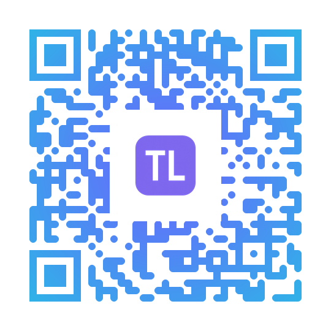

# Portfólio de Tatiane Lima

Bem-vindo(a) ao meu portfólio online! Este espaço foi desenvolvido para apresentar de forma clara meus projetos, habilidades técnicas e evolução como **Desenvolvedora de Software Júnior**. 

O projeto consolida meus conhecimentos em desenvolvimento focado em experiências modernas, responsividade, arquitetura limpa e alta performance.

---
## 📱 Acesse meu Portfólio pelo QR Code  

Escaneie o QR Code abaixo para abrir diretamente o site do meu portfólio:  

## 🔗 Links Importantes

- **Portfólio Online:** [Link para o site](https://tattianerl.github.io/Portifolio/)  
- **GitHub:** [Repositório](https://github.com/Tattianerl/Portifolio.git)  
- **LinkedIn:** [https://www.linkedin.com/in/tati-lima85](https://www.linkedin.com/in/tati-lima85)  
- **Currículo (PDF):** [CV_TatianeRL](./src/assets/cv/CV_TatianeRL.pdf)  

---

## 💻 Tecnologias Utilizadas

- **Front-end:** HTML5, CSS3, JavaScript (ES6+), React, React Native  
- **Versionamento:** Git & GitHub  
- **Design:** UX Design, Responsividade, Acessibilidade  
- **Integração:** Consumo de APIs  
- **Ferramentas Auxiliares:** Figma, ChatGPT, VS Code  
- **Python**: Geração de QRcode
---

## ⚡ Funcionalidades

1. **Seções Principais:**
   - Home/Hero com apresentação e links de redes sociais  
   - Projetos com cards dinâmicos puxados do GitHub  
   - Sobre e Contato integrados em painel único  
   - Timeline de formação, experiências e habilidades  

2. **Interatividade:**
   - Scroll Reveal suave ao navegar pelo site  
   - Botão de alternância entre **tema claro e escuro**  
   - Botões de redes sociais e CV com links externos  

3. **Responsividade:**
   - Layout adaptável para desktop, tablet e mobile  
   - Grid moderno para projetos e cards  

4. **Acessibilidade:**
   - Uso de tags semânticas (`<section>`, `<header>`, `<footer>`)  
   - Labels e `aria` para navegação assistida  

---

## 🛠️ Estrutura do Projeto

portifolio-frontend/  
│  
├─ qr_code/    
│  └─ logo_qr.png/   
│  └─qrcode_portifolio.py/     
├─ src/  
│ ├─ assets/  
│ │ ├─ img/  
│ │    └─ logo.png/   
│ │    └─ profile.jpeg/   
│ │    └─qr_portifolio.py/      
│ │ └─ cv/  
│ ├─ css/  
│ │ └─ style.css   
│ └─ js/  
│   └─ script.js   
├─ index.html   
└─ README.md   

---

## 📌 Observações

- Os **projetos** exibidos são os mais recentes do meu GitHub, com limite de 6 cards na tela inicial.   
- O **formulário de contato** envia emails de forma real e está integrado a um back-end ou serviço como EmailJS.  
- ⚠️ **Observação:** Este portfólio ainda **não está finalizado** e continuará sendo atualizado com novos projetos, melhorias visuais e funcionalidades.

## Contato

E-mail: tattiane85@hotmail.com  
whatssap: (21)9989-77628  
Instagram: https://www.instagram.com/limatati1/
